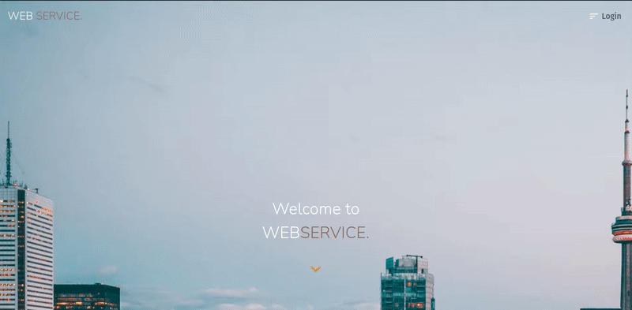

<h1 align="center">Hi 👋, I'm Federico</h1>
<h3 align="center">A fullstack developer from Argentina, I ♥ React and Express.</h3>

 

- 💪🏼 I like challenges
- ⛑️ Always willing to help
- 💻 I don't give up easily
- 🤓 I want to continue learning

---

### 🛠 Languages and Tools

 

<table align="center">
  <tr>
    <td align="center" width="96">
      
       HTML 5
    </td>
    <td align="center" width="96">
      
       CSS 3
    </td>
    <td align="center" width="96">
      
       Javascript
    </td>
    <td align="center" width="96">
      
       ReactJS
    </td>
    <td align="center" width="96">
      
       Redux
  </tr>
    </td>
    <td align="center" width="96">
      
       NodeJS
    </td>
    <td align="center" width="96"> 
      
       ExpressJS
    </td>
    <td align="center" width="96">
      
       Postgresql
    </td>    
    <td align="center"  width="96">
      
       Github
    </td>
    <td align="center"  width="96">
      
       npm
    </td>
  </tr>
    <td align="center"  width="96">
      
       Bootstrap
    </td>
    <td align="center"  width="96">
      
       Linux
    </td>
    <td align="center"  width="96">
      
       Postman
    </td>
    <td align="center"  width="96">
      
       Heroku
    </td>
     <td align="center"  width="96">
      
       Vercel
    </td>
  <tr>
  </tr>
</table>

 

---

 

### 💼 Projects

- Web Service
  

- Videogames
  

- Gif Finder
  

 

---

 

### 📫 Connect with me

