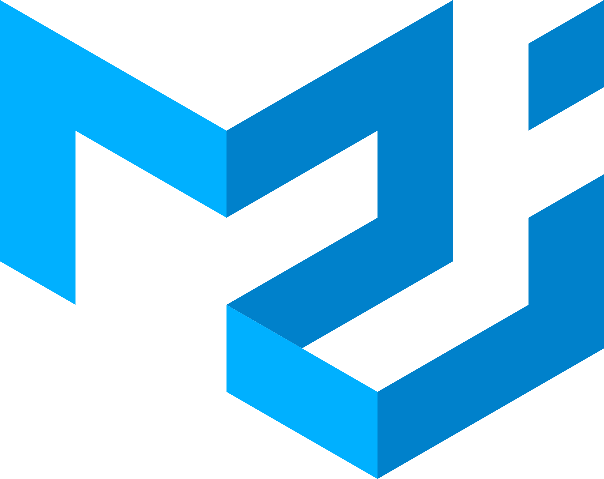
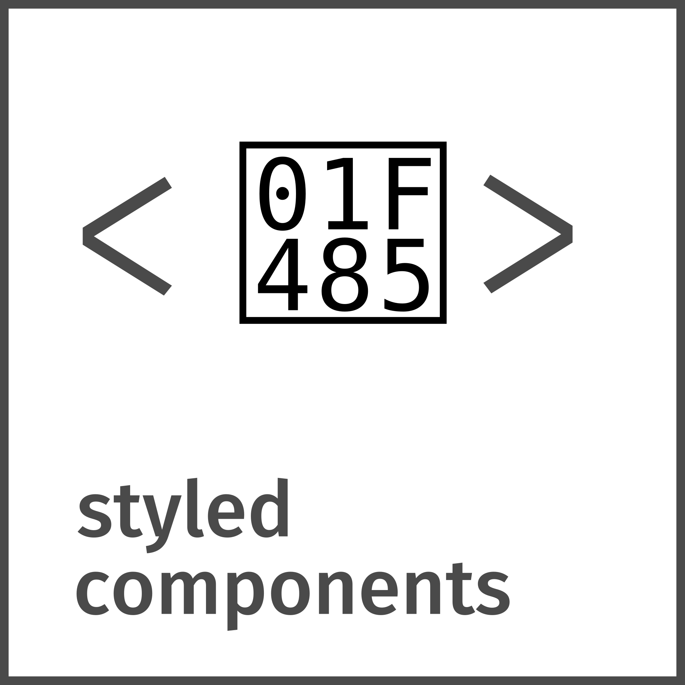
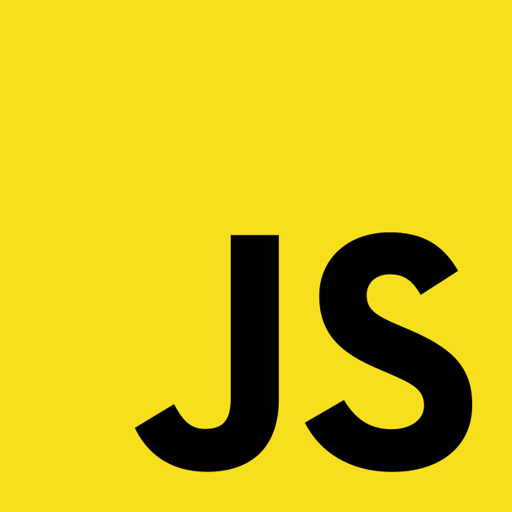
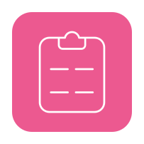
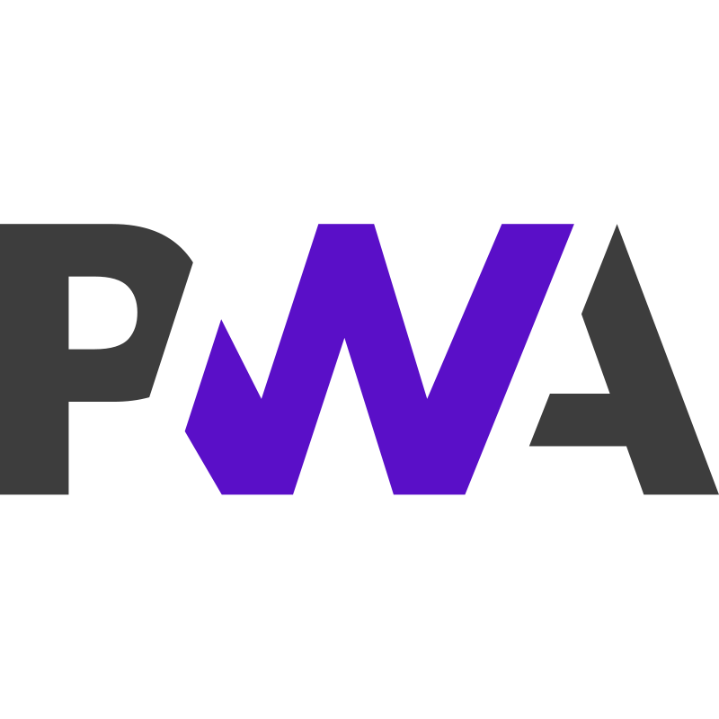
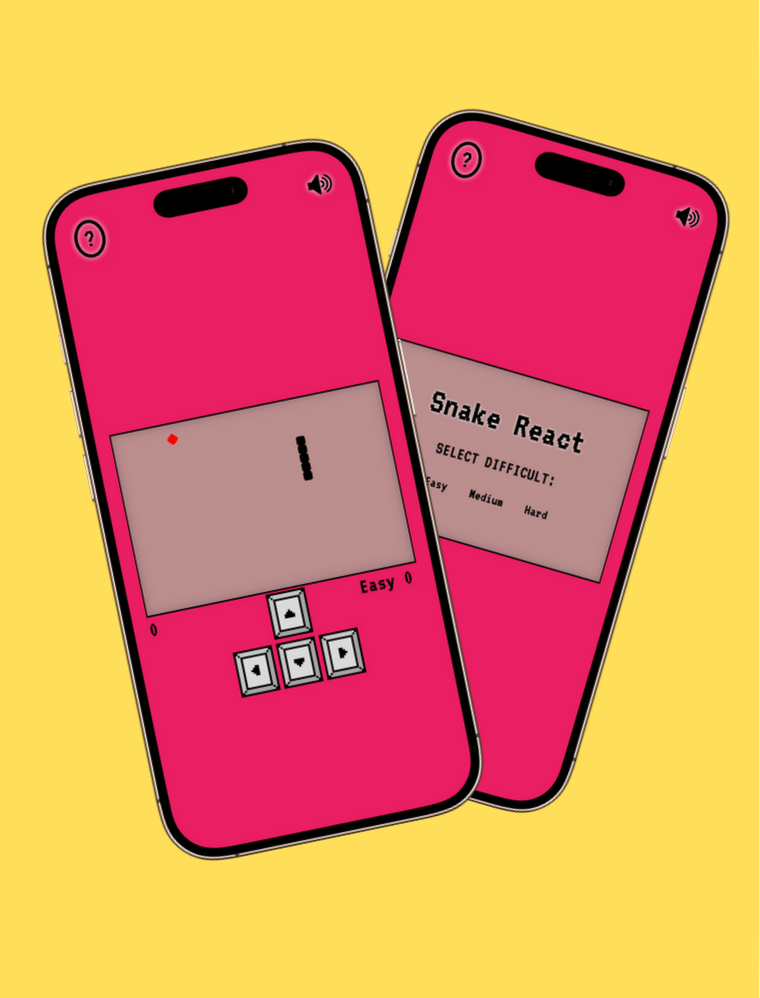
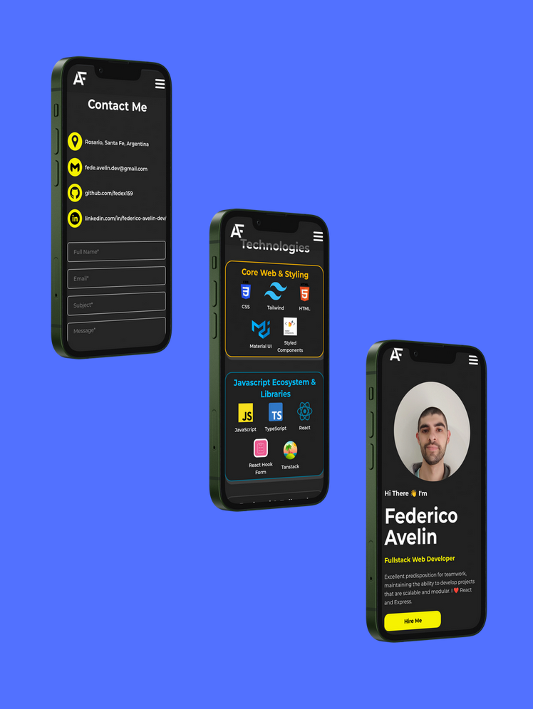
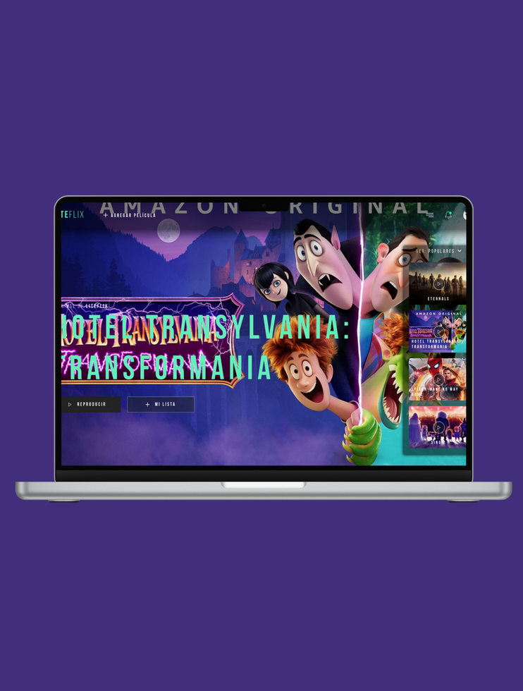
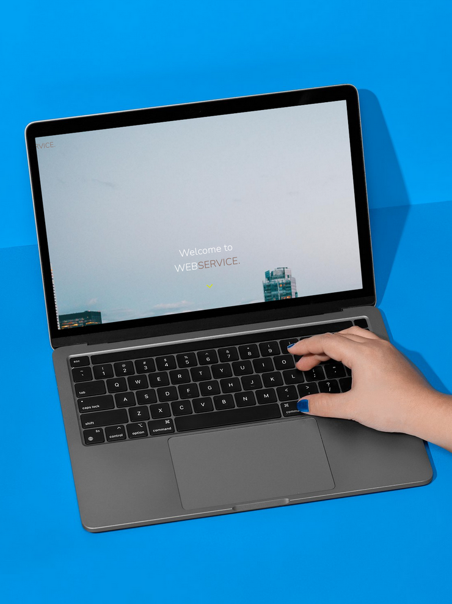
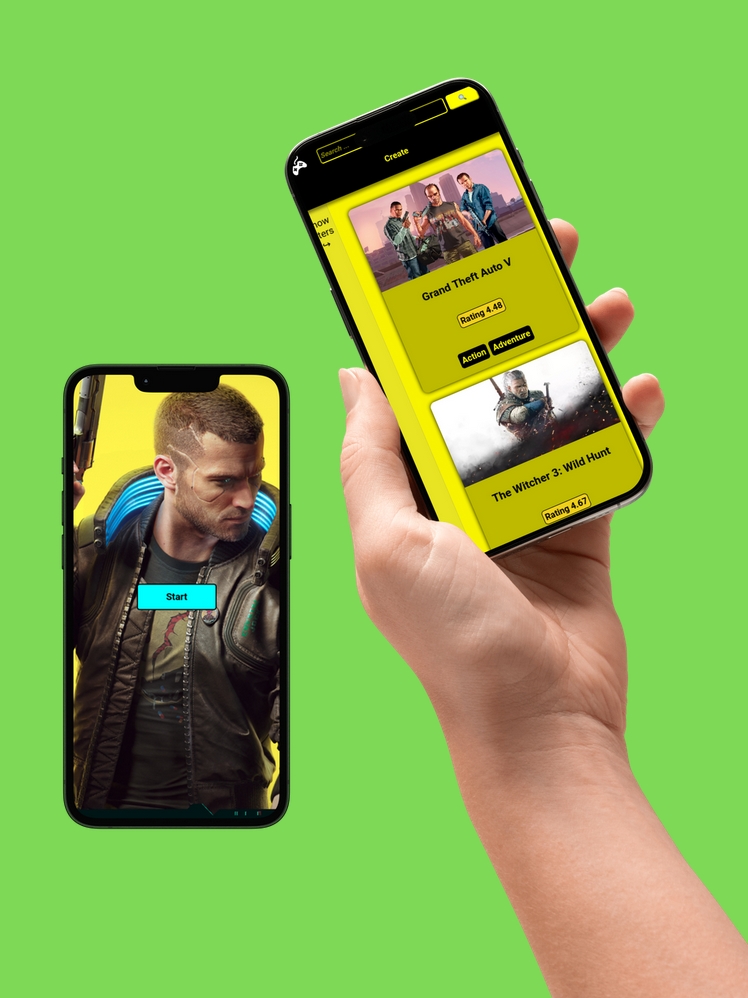

<h1 align="center">👋 Hi, I'm Federico</h1>
<h3 align="center">Frontend-focused Fullstack Developer | Next.js Specialist ⚡</h3>

🎨 Crafting pixel-perfect UX with modern stack & clean architecture

---

- 🚀 3+ years building production-ready apps with **Next.js**
- 🤝 Love bridging design & development through **UI/UX collaboration**
- 🧪 Obsessed with performance optimization and modern DX
- ⚡️ Passionate about: Modern fullstack patterns with Next.js + Vercel ecosystem

---

### 🛠 Languages and Tools

 

<table align="center">
  <tr>
    <td align="center" width="96">
      
      
CSS

    </td>
    <td align="center" width="96">
      
      
Tailwind CSS

    </td>
    <td align="center" width="96">
      
      
HTML

    </td>
    <td align="center" width="96">
      
      
Material UI

    </td>
    <td align="center" width="96">
      
      
Styled Components

    </td>
  </tr>
  <tr>
    <td align="center" width="96">
      
      
Javascript

    </td>
    <td align="center" width="96">
      
      
Typescript

    </td>
    <td align="center" width="96">
      
      
React

    </td>
    <td align="center" width="96">
      
      
React hook form

    </td>
    <td align="center" width="96">
      
      
Tanstack

    </td>
  </tr>
  <tr>
    <td align="center" width="96">
      
      
Express

    </td>
    <td align="center" width="96">
      
      
Node.js

    </td>
    <td align="center" width="96">
      
      
Next.js

    </td>
    <td align="center" width="96">
      
      
PostgreSQL

    </td>
    <td align="center" width="96">
      
      
Docker

    </td>
  </tr>
  <tr>
    <td align="center" width="96">
      
      
Git

    </td>
    <td align="center" width="96">
      
      
Linux

    </td>
    <td align="center" width="96">
      
      
Vite

    </td>
    <td align="center" width="96">
      
    
PWA

    </td>
    <td align="center" width="96">
      
      
npm

    </td>
  </tr>
</table>

 

---

### 💼 Projects

<table>
  <tr>
    <td align="center" width="275">
      
      
Snake React

    </td>
    <td align="center" width="275">
      
      
Portfolio

    </td>
    <td align="center" width="275">
      
      
Liteflix

    </td>
  </tr>
  <tr>
    <td align="center" width="275">
      
      
Web service

    </td>
    <td align="center" width="275">
      
      
Videogames

    </td>
    <td align="center" width="275">
      
      
Gif Finder

    </td>
  </tr>
</table>

 

---

### 📫 Connect with me

